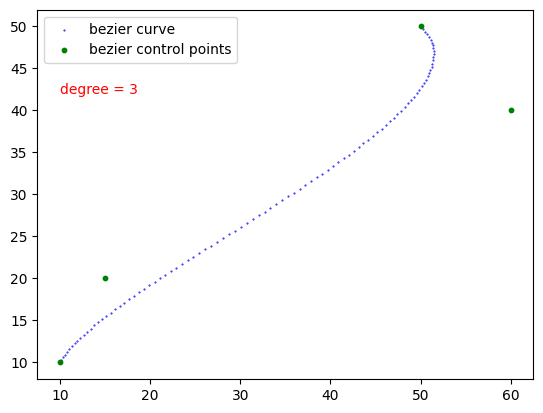

# Bezier Fit

  

* Define a Bezier Curve using it's control points and degree.

* Fit a curve to Bezier using Least Squares Fitting.

## Usage

1. Defining  a Bezier Curve and sample points from the curve
```python
from  bezier_fit  import  BezierCurve

control_points=[[10, 10], [15, 20], [60, 40], [50, 50]]
degree  =  3

curve  =  BezierCurve(degree=degree, control_points=control_points)
bezier_points  =  curve.get_curve(num=100) # num is the number of points to sample

```
```python
import  matplotlib.pyplot  as  plt

plt.scatter(x=[c[0] for  c  in  bezier_points], y=[c[1] for  c  in  bezier_points], c="blue", label="bezier curve", s=0.2)
plt.scatter(x=[c[0] for  c  in  curve.control_points], y=[c[1] for  c  in  curve.control_points], c="green", label="bezier control points", s=10)
plt.legend()
```  


2. Fit a curve to generate Bezier Ground Truth
```python
from  bezier_fit  import  BezierCurve
import  numpy  as  np

line_points  =  np.array([[10, 10], [20, 50], [40, 60], [45, 50], [45, 60], [50, 40], [60, 50]])
degree  =  3

curve  =  BezierCurve(degree=degree)
curve.fit(line_points)

bezier_points  =  curve.get_curve(num=100)
control_points  =  curve.control_points
```
```python
import  matplotlib.pyplot  as  plt

plt.scatter(x=[c[0] for  c  in  line_points], y=[c[1] for  c  in  line_points], c="red", label="original curve", marker='x')
plt.scatter(x=[c[0] for  c  in  bezier_points], y=[c[1] for  c  in  bezier_points], c="blue", label="bezier curve", s=0.2)
plt.scatter(x=[c[0] for  c  in  curve.control_points], y=[c[1] for  c  in  curve.control_points], c="green", label="bezier control points", s=10)
plt.legend()
```
